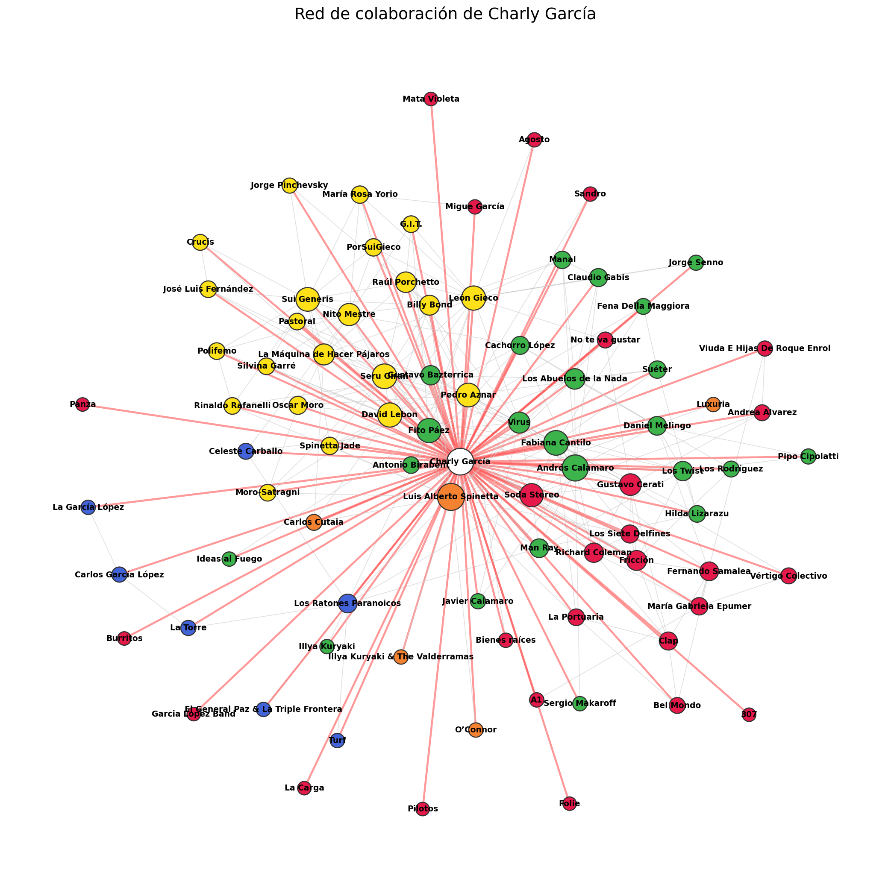
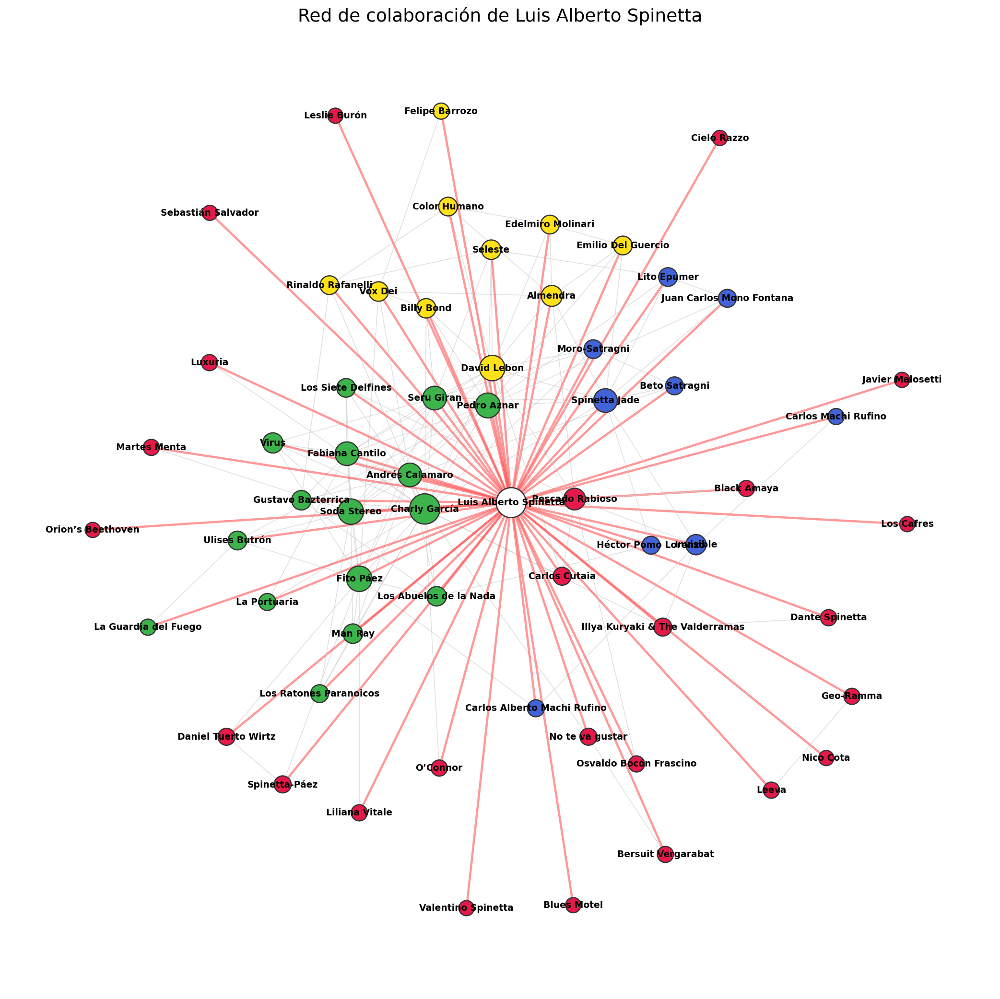

# 🎸 rockar-collab-network

**¿Quiénes son los verdaderos hubs del rock argentino?**

**[👉 Explorá la red interactiva](https://droyktton.github.io/rockar-collab-network/)**

*(la red completa tiene 6.155 nodos — en celular puede tardar unos segundos
en acomodarse o sentirse menos fluida; el timeline, el heatmap y los
ego-networks son más livianos y andan bien en cualquier dispositivo)*

Este proyecto descarga datos de [rock.com.ar](https://rock.com.ar) —la enciclopedia
del rock argentino online desde 1996— y construye la **red de colaboración**
entre artistas: quién grabó con quién, quién integró qué banda, quién aparece
mencionado junto a quién. Sobre esa red se calculan métricas de teoría de
grafos (hubs, comunidades, centralidad) y se generan visualizaciones para
explorarla.

> Proyecto de análisis de datos independiente. Sin afiliación con rock.com.ar.

---

## ✨ Qué hace

1. **Scraping respetuoso** de la enciclopedia (con caché en disco y rate
   limiting) para armar el índice completo de artistas, sus biografías y
   discografías — **5.778 artistas** indexados de la enciclopedia. El grafo
   final tiene **6.155 nodos** y **6.862 aristas** (incluye además algunos
   artistas mencionados/acreditados que no tienen ficha propia scrapeada).
2. **Construcción del grafo** de colaboración, combinando tres señales:
   - Links entre artistas mencionados en sus propias biografías
   - Créditos compartidos de disco (ej: *"Charly García y Pedro Aznar"*)
   - Menciones en texto plano sin link (ej: *"grabó junto a X"*), exigiendo
     una palabra de colaboración cerca del nombre para descartar simples
     menciones de influencia — esto es clave para capturar a músicos de
     sesión muy activos que rara vez están linkeados (ver hallazgos)
3. **Análisis de red** con [NetworkX](https://networkx.org/): densidad,
   componentes conexas, clustering, hubs por grado / betweenness / PageRank,
   detección de comunidades.
4. **Visualización**, en cuatro formas distintas:
   - Red completa interactiva (navegable en el browser)
   - Línea de tiempo (año de debut vs. conexiones, por comunidad)
   - Mapa de calor de actividad discográfica por comunidad y década
   - Ego-networks de artistas puntuales (su vecindario directo, sin ruido)

## 🔍 Algunos hallazgos

- **Charly García** es el hub más conectado de la red por lejos: 121
  colaboraciones directas, primero en el ranking de grado y de PageRank.
  **León Gieco** lo supera en intermediación (betweenness) — es quien más
  actúa de puente entre escenas que, si no fuera por él, quedarían
  desconectadas entre sí.
- Sumar menciones en texto plano (no sólo links) resolvió un problema real:
  músicos de sesión muy activos pero raramente linkeados quedaban casi
  invisibles en la red. **Marcelo Torres** (bajista que tocó con Spinetta,
  el Indio Solari y otros) pasó de estar prácticamente aislado a tener
  varias colaboraciones reales detectadas — incluyendo el patrón "Nombre en
  instrumento" típico de listas de formación de banda (ej. *"Marcelo Torres
  en bajo, Hernán Arramberri en batería..."*), que resolvió casos donde el
  nombre aparecía lejos de cualquier verbo de colaboración explícito.
- No todo link real implica colaboración musical: encontramos **Soda
  Stereo ↔ Sumo** conectados en la red, no porque hayan tocado juntos sino
  porque ambos participaron del mismo Festival Rock & Pop de los 80s junto
  a una decena de bandas más. El sitio linkea a todos los mencionados en
  ese párrafo, aunque no exista relación musical directa entre ellos. Esto
  llevó a separar "colaboración real" de "mismo evento/cartel" a nivel de
  oración (ver Metodología) — sin esa granularidad fina, se corre el
  riesgo de perder colaboraciones genuinas que aparecen en el mismo párrafo
  que una mención de festival, pero en otra oración distinta.
- Detectar estas menciones en texto libre trajo su propio desafío: nombres
  de artistas que también son frases comunes del español ("La Banda",
  "Buenos Aires", "El Resto") generaban miles de falsos positivos. Quedan
  documentados en `STOPLIST_NAMES_RAW` (`scraper.py`) junto con un chequeo
  automático que avisa si aparece un caso nuevo en corridas futuras.
- El grado (cantidad de colaboraciones documentadas) tiende a ser mayor
  para artistas con carreras más largas — es esperable: más años activos
  significan más oportunidades de colaboración documentada, no
  necesariamente mayor "importancia" en términos absolutos.

## 📸 Ejemplos: dos monstruos, dos vecindarios

Ego-networks de dos figuras centrales del rock argentino — mismo criterio de
conexión, mismo layout, generados con `ego_network.py`:

<table>
<tr>
<td width="50%"></td>
<td width="50%"></td>
</tr>
<tr>
<td align="center"><em>Charly García</em></td>
<td align="center"><em>Luis Alberto Spinetta</em></td>
</tr>
</table>

Versiones interactivas (navegables, con hover): [Charly García](https://droyktton.github.io/rockar-collab-network/ego-charly-garcia.html) · [Spinetta](https://droyktton.github.io/rockar-collab-network/ego-spinetta.html)

Estos dos son sólo ejemplos destacados — en realidad, **todo artista con más
de 5 colaboraciones tiene su propio ego-network generado** (con
`generate_ego_batch.py`). Se accede desde la
[lista completa de artistas](https://droyktton.github.io/rockar-collab-network/artistas.html):
el número de colaboraciones de cada fila es clickeable (🕸️) cuando existe.

## 📁 Qué genera

| Archivo | Contenido |
|---|---|
| `data/report.md` | Resumen de métricas: tamaño, densidad, hubs, comunidades |
| `data/nodes.csv` / `edges.csv` | Tablas planas con centralidades y pesos |
| `data/graph.gexf` / `.graphml` | El grafo, para abrir en [Gephi](https://gephi.org/) |
| `data/network_static.png` | Imagen coloreada por comunidad |
| `data/network_interactive.html` | Red completa navegable en el browser (6.155 nodos — más liviana en desktop que en celular) |
| `data/timeline_interactive.html` | Año de debut vs. grado, por comunidad |
| `data/heatmap_comunidad_decada.png` | Actividad discográfica por comunidad/década |
| `data/ego_<artista>.png` / `.html` | Red de colaboración de un artista puntual |

## 🚀 Instalación

```bash
git clone https://github.com/droyktton/rockar-collab-network.git
cd rockar-collab-network
python3 -m pip install -r requirements.txt
```

## 🕸️ Uso

```bash
# 1) Armar el índice de artistas
python3 scraper.py index

# 2) Bajar fichas de artista y créditos de disco (incluye año de edición)
python3 scraper.py artists
python3 scraper.py discs

# (o las tres etapas juntas)
python3 scraper.py all

# 3) Refinar las conexiones (opcional pero recomendado, reprocesa el caché,
#    no genera requests nuevos)
python3 scraper.py mentions       # menciones en texto plano con contexto de colaboración
python3 scraper.py bio-context    # separa colaboración real de "mismo festival/cartel"

# 4) Analizar el grafo
python3 analyze.py

# 5) Visualizar
python3 visualize.py --min-degree 2                          # red completa
python3 timeline.py --min-degree 2 --top-communities 10        # línea de tiempo
python3 heatmap.py --top-communities 10                        # mapa de calor
python3 ego_network.py "Charly Garcia" --hops 1                # ego-network puntual
python3 generate_ego_batch.py --min-degree 5                    # ego-networks masivos
python3 export_artist_list.py                                    # lista buscable, con links a ego-networks
```

Todo el detalle de opciones, tiempos esperados y cómo retomar una corrida
cortada está en [`USAGE.md`](USAGE.md).

## 🧠 Metodología y criterio de conexión

Dos artistas quedan conectados si:
- La biografía de uno **linkea** al otro (colaboración, integrante de banda, proyecto paralelo), o
- Aparecen **acreditados juntos** en la ficha de un mismo disco, o
- Uno **menciona al otro en texto plano** (sin link) con una palabra que indica
  colaboración real (*"grabó junto a"*, *"integrante de"*, *"tocó en bajo"*,
  etc.) — esto captura sobre todo a músicos de sesión que rara vez están linkeados

⚠️ **Colaboración real ≠ compartir cartel.** Al revisar los links reales de
biografía encontramos casos como *Soda Stereo* apareciendo conectado a
*Sumo* — no porque hayan tocado juntos, sino porque ambos participaron del
mismo Festival Rock & Pop de los 80s junto a una decena de bandas más. El
sitio linkea a todos los mencionados en ese párrafo, aunque no haya relación
musical directa entre ellos. Filtramos esto a nivel de **oración** (no de
párrafo completo, para no perder colaboraciones reales que aparecen en la
misma bio pero en otra oración distinta): si la oración donde vive un link
menciona un festival/cartel compartido, esa conexión se guarda aparte
(`bio_links_evento` en los datos crudos) y **no entra al grafo por default**.

⚠️ **Los nodos mezclan personas y bandas** sin distinguirlos (así están
modelados en la enciclopedia original), así que una arista puede representar
persona↔persona, persona↔banda o banda↔banda. Tenelo en cuenta al leer los
rankings de hubs: una banda longeva con mucha rotación de miembros puede
tener un grado alto sin que eso hable de una sola persona particularmente
conectada.

La red refleja **colaboración documentada en rock.com.ar**, no
necesariamente toda colaboración real existente — es tan completa como la
propia enciclopedia, y tan precisa como estas heurísticas de texto lo permiten.

## 🙏 Fuente y agradecimientos

Todos los datos (biografías, discografías, relaciones entre artistas) fueron
extraídos de **[rock.com.ar](https://rock.com.ar)**. Todo el crédito por el
contenido original es de su equipo editorial. Este repositorio comparte
únicamente el **código de análisis** y **datos derivados** (nombres, slugs,
relaciones estructuradas) para fines de investigación y visualización de
redes — no reproduce el contenido editorial del sitio (biografías completas,
textos, etc.).

Si este proyecto te resultó interesante, la mejor forma de agradecer es
visitar [rock.com.ar](https://rock.com.ar) y explorar las fichas originales
de los artistas que aparecen en la red.

El scraper respeta el `Request-rate` declarado en el `robots.txt` del sitio
(ver [USAGE.md](USAGE.md) para el detalle). Si sos parte del equipo de
rock.com.ar y algo de este repositorio te genera dudas o problemas, abrí un
[issue](https://github.com/droyktton/rockar-collab-network/issues) o
contactame directamente.

*Datos descargados en septiembre de 2026. La enciclopedia sigue
actualizándose, así que una corrida posterior puede dar resultados distintos.*

## 🤝 Créditos

Scraper, análisis de red, visualizaciones y esta página fueron desarrollados
con [Claude](https://claude.ai) (Anthropic).

## 📄 Licencia

El código de este repositorio se distribuye bajo licencia [MIT](LICENSE).
Los datos derivados de rock.com.ar se comparten con fines de investigación;
cualquier uso comercial debería consultarse con el sitio fuente.

## 🛠️ Stack

Python · [NetworkX](https://networkx.org/) · [BeautifulSoup4](https://www.crummy.com/software/BeautifulSoup/) · [Matplotlib](https://matplotlib.org/) · [pyvis](https://pyvis.readthedocs.io/) · [Plotly](https://plotly.com/python/)
